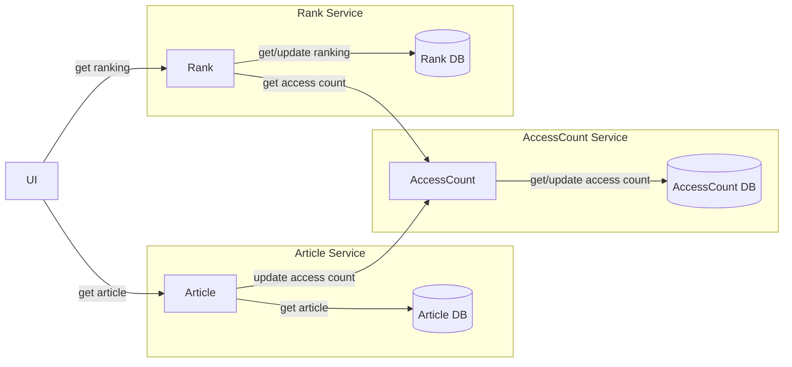
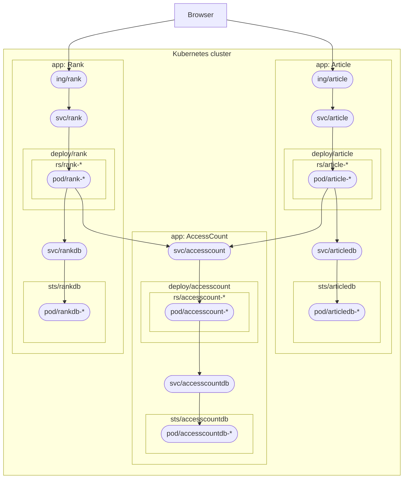

# README.md

## Project layout

- `deployment`

  Deployment manifest for develop/production release

- `package`

  Manifests for packaging (ex. `Dockerfile`) for develop/production release

- `scripts`

  Script files for build, run, and other development tasks.

- `src`

  Subprojects for application code.

## Architecture





## Develop

> Replace `${component}` to component name: `article`, `accesscount`, or `rank`.

### Develop with docker (Recommended)

- Build container images for development:

  ```bash
  ./scripts/build-develop-docker.sh "${component}"
  ```

  This script build and update container images named `${component}:dev-docker`

  `dev-docker` container optimized only for development. The image runs application with `mvn spring-boot:run` command, so application runs with `devtools`. `devtools` enables "hot reload" that provide great experience for development. But you should not run it public environment.

- Run container:

  ```bash
  ./scripts/run-develop-docker.sh "${component}"
  ```

- Or run all containers:

  ```bash
  ./scripts/docker-compose.sh up -d
  ```

### Develop with local Kubernetes

Run with on-premise kubernetes (constructed by `kubeadm`), `kind`, `minikube`, and kubernetes bundled with docker-desktop.

- Build container images for development

  ```bash
  ./scripts/build-develop.sh "${component}"
  ```

- Setup `kubectl` command to manipulate target kubernetes cluster:

  ```text
  $ kubectl cluster-info
  Kubernetes control plane is running at <target kubernetes apiserver endpoint>
  KubeDNS is running at <target kubernetes apiserver endpoint>/api/v1/namespaces/kube-system/services/kube-dns:dns/proxy

  To further debug and diagnose cluster problems, use 'kubectl cluster-info dump'.
  ```

- Run containers:

  ```bash
  kubectl apply -k ./deployment/develop/kubernetes/
  ```

- Access to service
  - With `port-forward`:

    ```bash
    kubectl port-forward svc/${component} 
    ```

### Develop without container

> You can install these Java tools by [SDKMAN!](https://sdkman.io)
>
> ```bash
> curl -s "https://get.sdkman.io" | bash
> sdk i java 11.0.10.hs-adpt
> sdk i maven 3.6.3
> ```

- JDK 11.0.10 hotspot
  - use AdoptOpenJDK
- Apache Maven 3.6.3
- docker 20.10.2
- docker-compose 1.28.5

Before you start application, you can start backend database:

```bash
./scripts/docker-compose.sh "${component}db"
```

Run your application:

```bash
./scripts/run-develop-host.sh "${component}"
```

## Troubleshoot memo

### MSYS2/Git Bash(Git for Windows)

- Do not use `MSYS2_ARG_CONV_EXCL` or disable that value on top of script like `mvn`/`mvnw`
  - Simple solution: remove environment variable `MSYS2_ARG_CONV_EXCL` from system, `.bashrc`, `.profile`, and so on.
  - If you want to use `MSYS2_ARG_CONV_EXCL='*'` or like it for some other reason, you can disable the variable on top of script. Add `export` command just after shebang like:

    ```sh
    #!/bin/sh
    export MSYS2_ARG_CONV_EXCL=''

    # ...
    ```

- Character encoding error(文字化け)
  - Many java tools output the error message to STDERR not STDOUT. If you use `iconv` command, may need redirect not only STDOUT but also STDERR to `iconv` like:

    ```bash
    mvn install 2>&1 | iconv -f sjis -t utf-8
    ```
